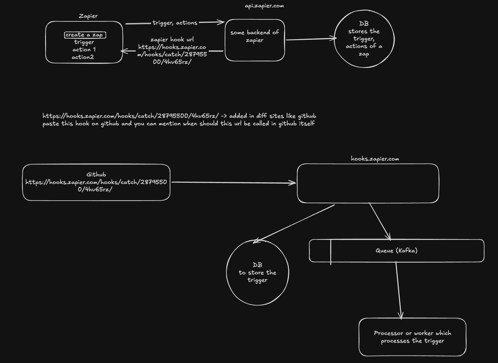
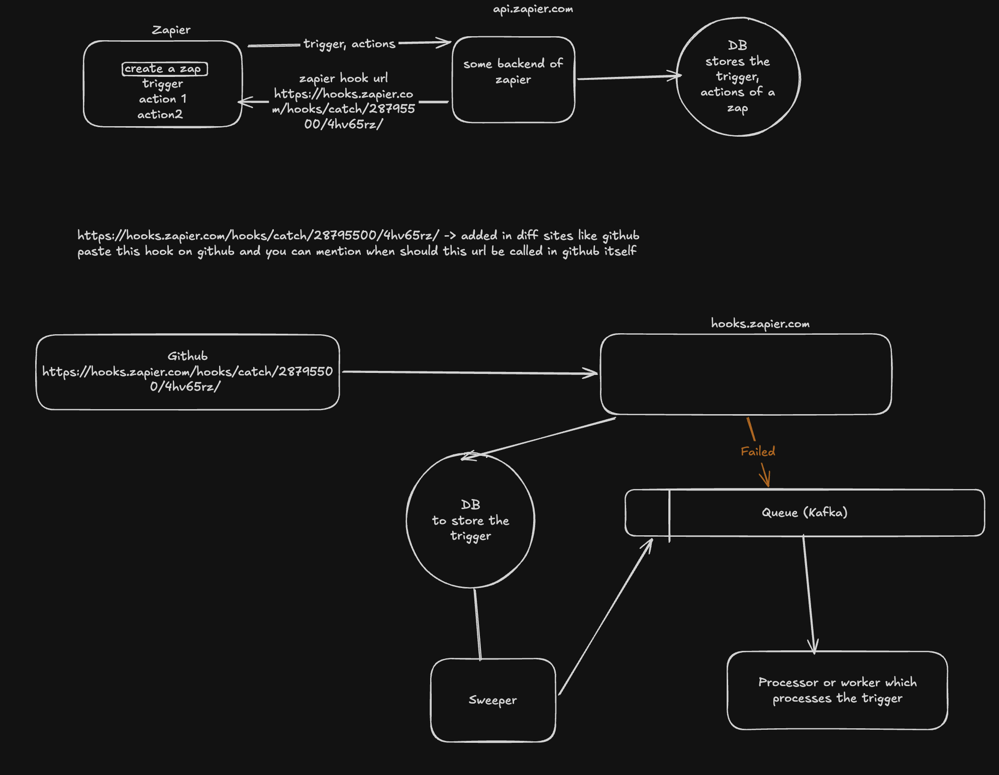
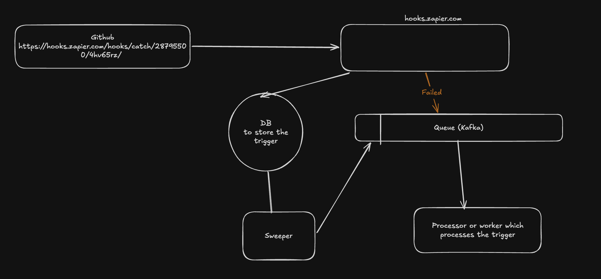
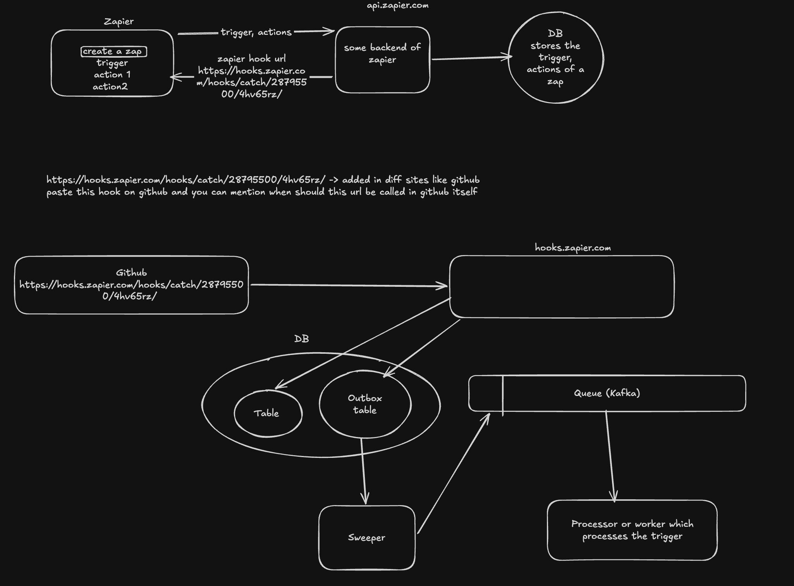
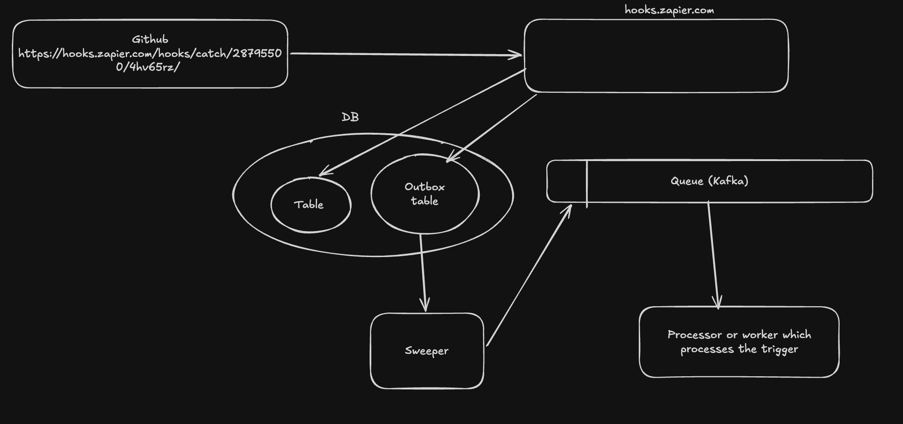

System Architecure of Zapier

# Initial


# Component Analysis

## Initial Write to DB

The webhook receiver first stores the trigger in the database with a `PROCESSING` state before sending it to Kafka.

This is important for four reasons:

1. **Fast response** – The webhook service can quickly acknowledge the request without waiting for the workflow to finish.
2. **Run history** – We have a record of every received trigger, even if processing later fails.
3. **Idempotency** – A unique webhook ID can be stored to detect duplicate webhook deliveries.
4. **Recovery** – If Kafka or a worker fails, we still know that the trigger was received and can retry it.

### What if Kafka fails?

There is a small gap between the DB write and the Kafka publish:

```text
Webhook → DB (PROCESSING) → Kafka
                         ↑
                    Kafka fails
```

# Problems

## Problem 1
Lets say a webhook call came to our services which handles /hooks.zapier.com and we have updated the entry in DB with write opeartion of that entry of the trigger (now state is in PROCSSING)
What if the kafka system goes doen before pushing the event to queue and only DB has been updated? trigger in Db will never be updated to PROCESSED state 

### Solution

Create a sweeper service i.e it constantly monitors db and if there is any entry of a trigger which is still in PROCESSING state, sweeper servies pushes that trigger to queue 





```text
DB (PROCESSING)
      ↓
Sweeper Service
      ↓
    Kafka
      ↓
   Worker
      ↓
DB (PROCESSED)
```

## Problem 2
Now, regarding the reverse scenario: DB write fails, but the Kafka push succeeds.

The best solution to this problem is actually preventing it from happening at the architectural level. Here are the three ways to handle or prevent this data inconsistency

### Solution
Transactional Outbox Pattern for Atomicity -> either all happens, else nothing happens

