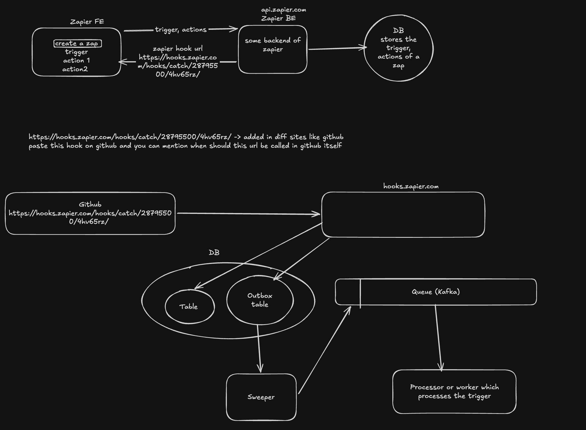

# System Architecure of Zapier

# Initial




# Component Analysis

## Why dont we do all computation in secondary backend itself? i.e i hooks/catch..

Decoupling is needed here. Reason:

1. Webhooks arrive unpredictably. If a user launches a viral marketing campaign, your server might receive 10,000 webhooks in a second. If you process heavy API calls synchronously, your Node.js server will exhaust its memory and drop incoming requests. A queue acts as a shock absorber, storing the flood of requests safely so workers can process them at a stable pace.

2. aps depend on third-party APIs (Slack, Gmail, OpenAI). These services frequently rate-limit you or experience downtime. If your Express route fails halfway through processing, the webhook data is lost forever. By placing the job in a queue, a background worker can safely retry the failed step later without losing the initial trigger data.

3. A Zap might have 10 steps, require generating an AI summary (which takes 10+ seconds), or even feature a "Delay for 2 hours" node. You cannot hold an HTTP connection open for that long; the client will sever it.

## Why cannot i use the same $transaction and write to to our dba nd kafka directly in that case we donot need outbox and a peocessor to push outbox db to kafka right?

Prisma's $transaction only controls your PostgreSQL database. It has absolutely zero power over external systems like Kafka, Redis, or third-party APIs.

When you use $transaction, Prisma is simply sending a BEGIN SQL command to Postgres, running your queries, and then sending a COMMIT or ROLLBACK SQL command at the very end. It does not magically reverse JavaScript execution or undo network requests made to other servers.

## Should you update the status or delete the message in outbox after publishing data to kafka?

Deleting the message is the standard, recommended practice for a Transactional Outbox.

Here is why deleting is better than updating the status:

Performance: An outbox table's only purpose is to bridge the gap between your database and Kafka. Once the message is safely in Kafka, keeping the row in Postgres is just dead weight. If you only update the status, your ZapOutbox table will eventually grow to millions of rows, slowing down your Sweeper query.

Simplicity: Your Sweeper can use a simple SQL query like DELETE FROM ZapOutbox RETURNING \*; to fetch the tasks and clean the queue simultaneously.

## Initial Write to DB

The webhook receiver first stores the trigger in the database with a `PROCESSING` state before sending it to Kafka.

This is important for four reasons:

1. **Fast response** – The webhook service can quickly acknowledge the request without waiting for the workflow to finish.
2. **Run history** – We have a record of every received trigger, even if processing later fails.
3. **Idempotency** – A unique webhook ID can be stored to detect duplicate webhook deliveries.
4. **Recovery** – If Kafka or a worker fails, we still know that the trigger was received and can retry it.

### What if Kafka fails?

There is a small gap between the DB write and the Kafka publish:

```text
Webhook → DB (PROCESSING) → Kafka
                         ↑
                    Kafka fails
```

# Problems

## Problem 1

Lets say a webhook call came to our services which handles /hooks.zapier.com and we have updated the entry in DB with write opeartion of that entry of the trigger (now state is in PROCSSING)
What if the kafka system goes doen before pushing the event to queue and only DB has been updated? trigger in Db will never be updated to PROCESSED state

### Solution

Create a sweeper service i.e it constantly monitors db and if there is any entry of a trigger which is still in PROCESSING state, sweeper servies pushes that trigger to queue


```text
DB (PROCESSING)
      ↓
Sweeper Service
      ↓
    Kafka
      ↓
   Worker
      ↓
DB (PROCESSED)
```

## Problem 2

Now, regarding the reverse scenario: DB write fails, but the Kafka push succeeds.

The best solution to this problem is actually preventing it from happening at the architectural level. Here are the three ways to handle or prevent this data inconsistency

### Solution

Transactional Outbox Pattern for Atomicity -> either all happens, else nothing happens


## Kafka replay/debugging note

During worker testing, we discovered that deleting and recreating the Kafka topic stopped the endless replay loop because the topic still had old messages sitting in it.

What happened:

1. The worker was consuming from the same Kafka topic it was also publishing to.
2. The consumer was subscribed with `fromBeginning: true`, which means Kafka re-read all previously stored messages from the beginning of the topic when the worker restarted.
3. The worker was also producing a new event back into the same topic after processing a stage, creating a self-trigger loop.
4. Because the offsets were not being safely committed before the next iteration, the same `stage: 0` message kept being delivered again and again.

This produced logs like:

```text
Received event from topic zap-events: {"zapRunId":"...","stage":0}
Sedning out an solana
Pushed above event ... to Kafka
Received event from topic zap-events: {"zapRunId":"...","stage":0}
...
```

Why recreating the topic fixed it:

- it removed the previously retained messages from the broker
- the consumer started from a clean topic state
- the replay loop no longer had stale events to consume repeatedly

Practical lessons:

- do not consume and publish on the same Kafka topic in the same worker unless you intentionally want a feedback loop
- avoid `fromBeginning: true` for normal app runs; use it only for deliberate replay/debugging
- always commit offsets only after a message is fully processed
- when debugging Kafka loops, deleting and recreating the topic is a fast way to verify whether stale messages are the cause
